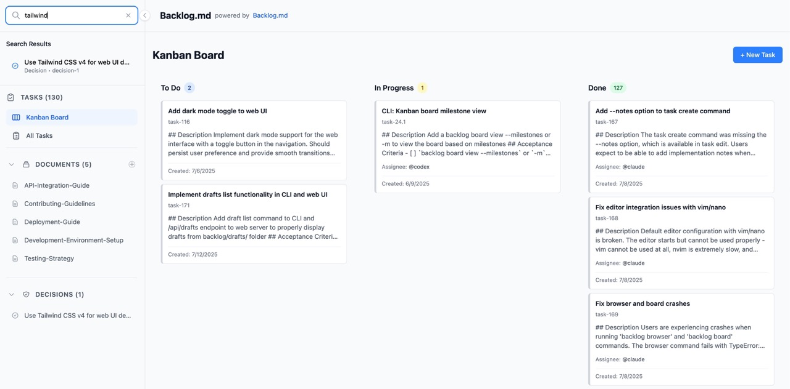

<h1 align="center">Backlog.md</h1>
<p align="center">Markdown‑native Task Manager &amp; Kanban visualizer for any Git repository</p>

<p align="center">
<code>npm i -g backlog.md</code> or <code>bun add -g backlog.md</code> or <code>brew install backlog-md</code>
</p>


---

> **Backlog.md** turns any folder with a Git repo into a **self‑contained project board**  
> powered by plain Markdown files and a zero‑config CLI.


## Features

* 📝 **Markdown-native tasks** -- manage every issue as a plain `.md` file

* 🔒 **100 % private & offline** -- backlog lives entirely inside your repo

* 📊 **Instant terminal Kanban** -- `backlog board` paints a live board in your shell

* 📤 **Board export** -- `backlog board export` creates shareable markdown reports

* 🌐 **Modern web interface** -- `backlog browser` launches a sleek web UI for visual task management

* 🤖 **AI-ready CLI** -- "Claude, please take over task 33"

* 🔍 **Rich query commands** -- view, list, filter, or archive tasks with ease

* 💻 **Cross-platform** -- runs on macOS, Linux, and Windows

* 🆓 **MIT-licensed & open-source** -- free for personal or commercial use

---

### Five‑minute tour

```markdown
# Make sure you have Backlog.md installed
bun/npm i -g backlog.md

# 1. Bootstrap a repo + backlog
backlog init hello-

# 2. Capture work
backlog task create "Render markdown as kanban"

# 3. See where you stand
backlog board view

# 4. Working with AI
Claude I would like to build a search functionality in the web view that searches for:
* tasks
* docs
* decisions
Please create relevant tasks to tackle this request.
```

All data is saved under `backlog` folder as human‑readable Markdown with the following format `task-<task-id> - <task-title>.md` (e.g. `task-12 - Fix typo.md`).

---

### Web Interface

Launch a modern, responsive web interface for visual task management:

```bash
# Start the web server (opens browser automatically)
backlog browser

# Custom port
backlog browser --port 8080

# Don't open browser automatically
backlog browser --no-open
```



The web interface provides:
- **Interactive Kanban board** with drag-and-drop functionality
- **Task creation and editing** with rich forms and validation
- **Real-time updates** as you manage tasks
- **Responsive design** that works on desktop and mobile
- **Archive tasks** with confirmation dialogs
- **Seamless CLI integration** - changes sync with your markdown files

---

## CLI reference

### Project Setup

| Action      | Example                                              |
|-------------|------------------------------------------------------|
| Initialize project | `backlog init [project-name]` (creates backlog structure with interactive configuration) |
| Re-initialize | `backlog init` (preserves existing config, allows updates) |

The `backlog init` command provides comprehensive project setup with interactive prompts for:
- **Project name** - identifier for your backlog
- **Auto-commit** - whether to automatically commit task changes to git
- **Default editor** - editor command for opening tasks (detects from environment)
- **Remote operations** - enable/disable fetching tasks from remote branches
- **Web UI settings** - port and browser auto-open preferences

When re-initializing an existing project, all current configuration values are preserved and pre-populated in prompts, allowing you to update only what you need.

### Task Management

| Action      | Example                                              |
|-------------|------------------------------------------------------|
| Create task | `backlog task create "Add OAuth System"`                    |
| Create with description | `backlog task create "Feature" -d "Add authentication system"` |
| Create with assignee | `backlog task create "Feature" -a @sara`           |
| Create with status | `backlog task create "Feature" -s "In Progress"`    |
| Create with labels | `backlog task create "Feature" -l auth,backend`     |
| Create with priority | `backlog task create "Feature" --priority high`     |
| Create with plan | `backlog task create "Feature" --plan "1. Research\n2. Implement"`     |
| Create with AC | `backlog task create "Feature" --ac "Must work,Must be tested"` |
| Create with notes | `backlog task create "Feature" --notes "Started initial research"` |
| Create with deps | `backlog task create "Feature" --dep task-1,task-2` |
| Create sub task | `backlog task create -p 14 "Add Login with Google"`|
| Create (all options) | `backlog task create "Feature" -d "Description" -a @sara -s "To Do" -l auth --priority high --ac "Must work" --notes "Initial setup done" --dep task-1 -p 14` |
| List tasks  | `backlog task list [-s <status>] [-a <assignee>] [-p <parent>]` |
| List by parent | `backlog task list --parent 42` or `backlog task list -p task-42` |
| View detail | `backlog task 7` (interactive UI, press 'E' to edit in editor) |
| View (AI mode) | `backlog task 7 --plain`                           |
| Edit        | `backlog task edit 7 -a @sara -l auth,backend`       |
| Add plan    | `backlog task edit 7 --plan "Implementation approach"`    |
| Add AC      | `backlog task edit 7 --ac "New criterion,Another one"`    |
| Add notes   | `backlog task edit 7 --notes "Completed X, working on Y"` |
| Add deps    | `backlog task edit 7 --dep task-1 --dep task-2`     |
| Archive     | `backlog task archive 7`                             |

### Draft Workflow

| Action      | Example                                              |
|-------------|------------------------------------------------------|
| Create draft | `backlog task create "Feature" --draft`             |
| Draft flow  | `backlog draft create "Spike GraphQL"` → `backlog draft promote 3.1` |
| Demote to draft| `backlog task demote <id>` |

### Board Operations

| Action      | Example                                              |
|-------------|------------------------------------------------------|
| Kanban board      | `backlog board` (interactive UI, press 'E' to edit in editor) |
| Export board | `backlog board export [file]` (exports Kanban board to markdown) |

### Web Interface

| Action      | Example                                              |
|-------------|------------------------------------------------------|
| Web interface | `backlog browser` (launches web UI on port 6420) |
| Web custom port | `backlog browser --port 8080 --no-open` |

### Configuration

| Action      | Example                                              |
|-------------|------------------------------------------------------|
| Config editor | `backlog config set defaultEditor "code --wait"` |
| Enable auto-commit | `backlog config set autoCommit true` |
| View config | `backlog config list` |

### Documentation

| Action      | Example                                              |
|-------------|------------------------------------------------------|
| Create doc | `backlog doc create "API Guidelines"` |
| Create with path | `backlog doc create "Setup Guide" -p guides/setup` |
| Create with type | `backlog doc create "Architecture" -t technical` |
| List docs | `backlog doc list` |
| View doc | `backlog doc view doc-1` |

### Decisions

| Action      | Example                                              |
|-------------|------------------------------------------------------|
| Create decision | `backlog decision create "Use PostgreSQL for primary database"` |
| Create with status | `backlog decision create "Migrate to TypeScript" -s proposed` |

### Agent Instructions

| Action      | Example                                              |
|-------------|------------------------------------------------------|
| Update agent files | `backlog agents --update-instructions` (updates .cursorrules, CLAUDE.md, AGENTS.md, GEMINI.md, .github/copilot-instructions.md) |

### Maintenance

| Action      | Example                                              |
|-------------|------------------------------------------------------|
| Cleanup done tasks | `backlog cleanup` (move old completed tasks to completed folder) |

Full help: `backlog --help`

---

## Configuration

Backlog.md merges the following layers (highest → lowest):

1. CLI flags  
2. `backlog/config.yml` (per‑project)  
3. `~/backlog/user` (per‑user)  
4. Built‑ins  

Key options:

| Key               | Purpose            | Default                       |
|-------------------|--------------------|-------------------------------|
| `default_assignee`| Pre‑fill assignee  | `[]`                          |
| `default_status`  | First column       | `To Do`                       |
| `statuses`        | Board columns      | `[To Do, In Progress, Done]`  |
| `date_format`     | ISO or locale      | `yyyy-mm-dd`                  |
| `default_editor`  | Editor for 'E' key | Platform default (nano/notepad) |
| `default_port`    | Web UI port        | `6420`                        |
| `auto_open_browser`| Open browser automatically | `true`            |
| `remote_operations`| Enable remote git operations | `true`           |
| `auto_commit`     | Automatically commit task changes | `false`       |

> **Note**: Set `remote_operations: false` to work offline. This disables git fetch operations and loads tasks from local branches only, useful when working without network connectivity.

> **Git Control**: By default, `auto_commit` is set to `false`, giving you full control over your git history. Task operations will modify files but won't automatically commit changes. Set `auto_commit: true` if you prefer automatic commits for each task operation.

---

## Sharing & Export

### Board Export

Export your Kanban board to a clean, shareable markdown file:

```bash
# Export to default Backlog.md file
backlog board export

# Export to custom file
backlog board export project-status.md

# Force overwrite existing file
backlog board export --force
```

Perfect for sharing project status, creating reports, or storing snapshots in version control.

---

<!-- BOARD_START -->

## 📊 Backlog.md Project Status (automatically generated by Backlog.md)

Generated on: 2025-07-13 17:55:16

| To Do | In Progress | Done |
| --- | --- | --- |
| **task-183** - Add ordinal field for custom task ordering in web UI<br>(Assignees: none, Labels: none) | **└─ task-24.1** - CLI: Kanban board milestone view<br>(Assignees: @codex, Labels: none) | **task-185** - Fix task listing incorrectly including README.md files<br>(Assignees: @claude, Labels: none) |
| **task-181** - Add statistics dashboard to web UI<br>(Assignees: none, Labels: none) |  | **task-184** - Investigate Windows bug with task edit status command<br>(Assignees: @claude, Labels: none) |
| **task-180** - Add statistics overview command to CLI with TUI interface<br>(Assignees: none, Labels: none) |  | **task-182** - Document agents command and reorganize README CLI reference tables<br>(Assignees: @claude, Labels: none) |
| **task-179** - Add Settings page to web UI with configuration management<br>(Assignees: none, Labels: none) |  | **task-178** - Enhance backlog init with comprehensive configuration and re-initialization support<br>(Assignees: @claude, Labels: none) |
| **task-175** - Add hour and minute to all dates in drafts, tasks, documents, decisions<br>(Assignees: none, Labels: none) |  | **task-177** - Automate Kanban board updates in README.md on release<br>(Assignees: @gemini, Labels: none) |
| **task-172** - Order tasks by status and ID in both web and CLI lists<br>(Assignees: none, Labels: none) |  | **task-176** - Add Priority Filtering/Sorting to Task List. Especially with the --plain flag.<br>(Assignees: none, Labels: enhancement) |
| **task-171** - Implement drafts list functionality in CLI and web UI<br>(Assignees: none, Labels: none) |  | **task-174** - Implement backlog cleanup command with completed folder management<br>(Assignees: none, Labels: none) |
|  |  | **task-173** - Add CLI command to export Kanban board to markdown<br>(Assignees: @claude, Labels: none) |
|  |  | **task-169** - Fix browser and board crashes<br>(Assignees: @claude, Labels: none) |
|  |  | **task-168** - Fix editor integration issues with vim/nano<br>(Assignees: @claude, Labels: none) |
|  |  | **task-167** - Add --notes option to task create command<br>(Assignees: @claude, Labels: none) |
|  |  | **task-166** - Audit and fix autoCommit behavior across all commands<br>(Assignees: none, Labels: bug, config) |
|  |  | **task-165** - Fix BUN_OPTIONS environment variable conflict<br>(Assignees: none, Labels: bug) |
|  |  | **task-164** - Add auto_commit config option with default false<br>(Assignees: none, Labels: enhancement, config) |
|  |  | **task-163** - Fix intermittent git failure in task edit<br>(Assignees: none, Labels: bug) |
|  |  | **task-120** - Add offline mode configuration for remote operations<br>(Assignees: none, Labels: enhancement, offline, config) |
|  |  | **└─ task-119.1** - Fix comprehensive test suite for data model consistency<br>(Assignees: none, Labels: none) |
|  |  | **└─ task-119.2** - Core architecture improvements and ID generation enhancements<br>(Assignees: none, Labels: none) |
|  |  | **└─ task-118.1** - UI/UX improvements and responsive design enhancements<br>(Assignees: none, Labels: none) |
|  |  | **└─ task-118.2** - Implement health check API endpoint for web UI monitoring<br>(Assignees: none, Labels: none) |
|  |  | **└─ task-118.3** - Advanced search and navigation features beyond basic requirements<br>(Assignees: none, Labels: none) |
|  |  | **task-116** - Add dark mode toggle to web UI<br>(Assignees: @claude, Labels: none) |
|  |  | **task-115** - Add live health check system to web UI<br>(Assignees: none, Labels: none) |
|  |  | **task-114** - cli: filter task list by parent task<br>(Assignees: none, Labels: none) |
|  |  | **task-101** - Show task file path in plain view<br>(Assignees: none, Labels: none) |

<!-- BOARD_END -->

## License

Backlog.md is released under the **MIT License** – do anything, just give credit. See [LICENSE](LICENSE).
